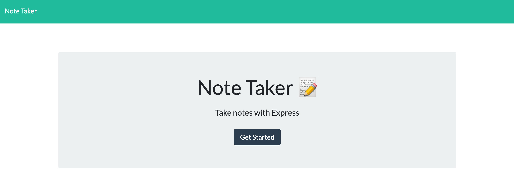
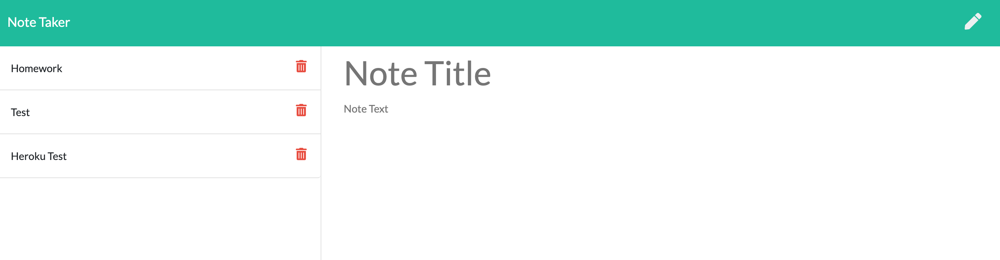
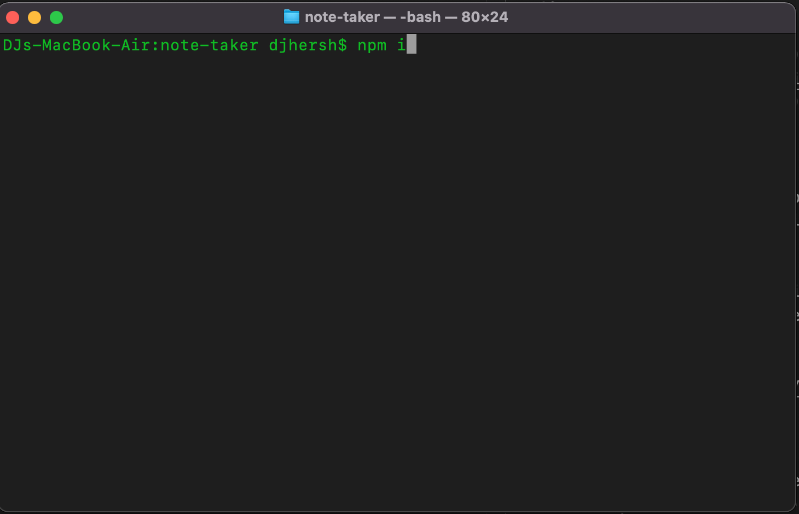
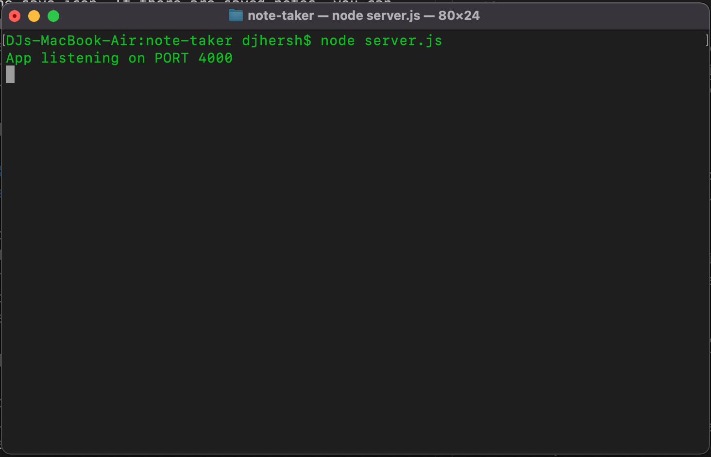

# Note Taker App

## Description

This is an application that allows the user to write, save, and delete notes. It uses express to create a server that hosts the webpage and stores the information.

## Table of Contents

* [Link](#link)
* [Usage](#usage)
* [Credits](#credits)
* [Questions](#questions)
* [License](#license)

## Link

Heroku deployed application: 
https://evening-gorge-05301.herokuapp.com/

## Usage

### If you are using this application as a standard user:

Once you get to the main page, click on the 'Get Started' button and you will be redirected to the notes page. 
    

    
Here, you can create a new note by giving the note a title and text, then save the note by pressing the save icon. If there are saved notes, you can click on any of them to view the full note. If you decide you don't want a particular note on the page any longer, you can press the delete icon to delete that note from the page (and the database).

### If you are using this application as a developer:

To host this application, you must first fork and clone this repository. You must also have Node.js on your system. Open your terminal, navigate to the app's folder, and download the necessary npm packages by typing 'npm i' and hitting enter.

To get the site up and running, you will need to run the server. To do this, once again open your terminal, navigate to the app's folder, and type 'node server.js'. You should see a message that says "App listening on PORT 4000".

## Credits

First I must credit the UCLA Extension Full-Stack Web Development Coding Bootcamp, instructor Bryan Swarthout, and TA Wilson Lam for providing me with all of the tools and knowledge I used to build this application.

http://www.uclaextension.edu

The npm package "Express" was used to create the server.

https://expressjs.com/

## Questions

For any questions, I, DJ Hersh, can be contacted via email at DanielJHersh@gmail.com

My GitHub profile is located at https://github.com/DJ620

## License

MIT License

Copyright (c) [2020] [DJ Hersh]

Permission is hereby granted, free of charge, to any person obtaining a copy
of this software and associated documentation files (the "Software"), to deal
in the Software without restriction, including without limitation the rights
to use, copy, modify, merge, publish, distribute, sublicense, and/or sell
copies of the Software, and to permit persons to whom the Software is
furnished to do so, subject to the following conditions:

The above copyright notice and this permission notice shall be included in all
copies or substantial portions of the Software.

THE SOFTWARE IS PROVIDED "AS IS", WITHOUT WARRANTY OF ANY KIND, EXPRESS OR
IMPLIED, INCLUDING BUT NOT LIMITED TO THE WARRANTIES OF MERCHANTABILITY,
FITNESS FOR A PARTICULAR PURPOSE AND NONINFRINGEMENT. IN NO EVENT SHALL THE
AUTHORS OR COPYRIGHT HOLDERS BE LIABLE FOR ANY CLAIM, DAMAGES OR OTHER
LIABILITY, WHETHER IN AN ACTION OF CONTRACT, TORT OR OTHERWISE, ARISING FROM,
OUT OF OR IN CONNECTION WITH THE SOFTWARE OR THE USE OR OTHER DEALINGS IN THE
SOFTWARE.